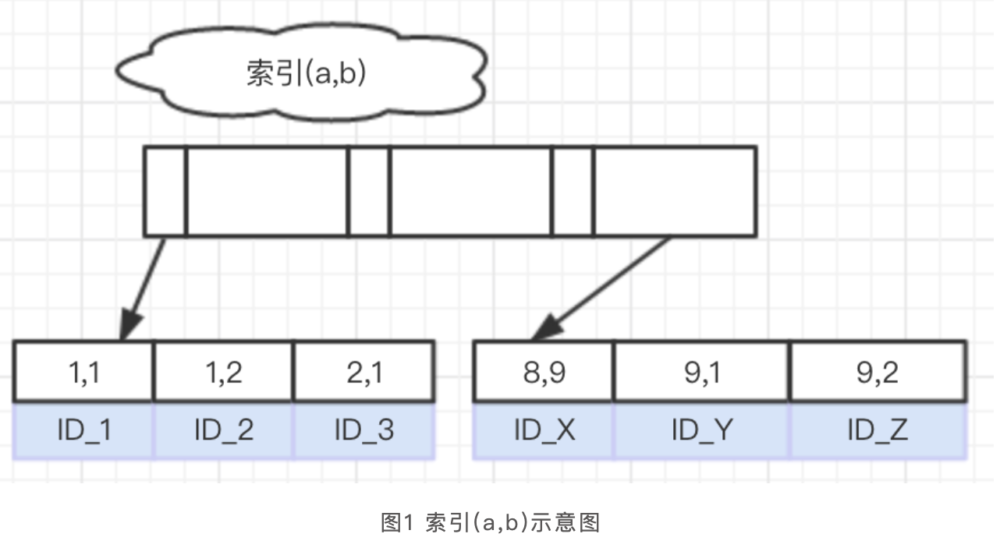

### 索引执行情况

https://juejin.cn/post/7028373141017591845
https://chatgpt.com/c/672b9e8a-60b8-800d-a3a6-f462fb616205

- 每个字段代表的意思：

- id: 查询的标识符
- select_type: 查询的类型。
- table: 查询涉及的表。
- partitions: 查询涉及的分区。
- type: 访问类型。
- possible_keys: 可能使用的索引。
- key: 实际使用的索引。
- key_len: 索引长度。
- ref: 使用的列或常量。
- rows: 估计需要读取的行数。
- filtered: 过滤的百分比。
- Extra: 额外的信息。


```text

假设你有以下索引 (user_id, friend_name, friend_addr)：
查询 WHERE user_id = X ORDER BY friend_name 时，可以利用索引来进行排序。
查询 WHERE friend_name = Y ORDER BY friend_addr 时，无法利用索引顺序，因为跳过了 user_id。

解释:
WHERE 子句的作用：当 WHERE user_id = X 这个条件指定了 user_id 的值，数据库就只会查找 user_id 等于 X 的那一部分数据，相当于在索引中限定了一个范围。
范围内的排序：在找到 user_id = X 的数据范围后，索引在该范围内其实已经按照 friend_name 排好序了，因此 ORDER BY friend_name 可以直接使用索引中的顺序，而无需额外的排序操作。
条件只需指定而无需排序：联合索引的排序顺序按左到右依次排列，但只要在 WHERE 中使用了最左侧的字段 user_id，就可以通过索引定位到指定范围，之后的排序只需要按 friend_name 排序即可。
```

```text
id ：没什么就是ID而已，如果没有子查询的话，通常就一行。
select_type ：大致分为简单查询和复杂查询两类，复杂查询又分为简单子查询，派生表（from中的子查询）和union。一般我们看见simple比较多，代表不包含子查询和union，如果有复杂查询则会标记成primary。
table ：表名
type ：表示关联类型，决定Mysql通过什么方式查找行数据。这个一般就是我们看查询时候的关键信息点。比如ALL就是全表扫描；index代表使用索引；range代表有限制的扫描索引，回比直接扫描全部索引好一些；ref也是索引查找，会返回匹配具体某个值的行数据，这个还有一些其他类型，比如eq_ref只返回符合的一条记录，const会进行优化转换成常量。
possible_keys ：显示可以使用的索引，但不一定用。
key ：实际使用到的索引。
key_len ：索引使用的字节数。
ref ：代表上面key一列中使用索引查找用到的列或者常量值。
rows ：为了找到符合条件的数据读取的行数。
filtered ：表示查询符合条件的数据占表的行数百分比，rows*filtered可以大致得到关联的行数，Mysql5.1之后新增的字段。
Extra ：额外信息，比如using index表示使用覆盖索引，using where表示在存储引擎之后进行过滤，using temporary表示使用临时表，using filesort表示对结果进行外部排序。
```


### 索引下推
```text
索引下推,5.6之后才有的特性

explain 查看extra:using index condition

没有索引下推,先查索引,查到一个之后,回表,在继续根据索引过滤
有索引下推,之后,不包含在索引的完整行数据不会被检索

有效果的情况:where条件可以在索引层面过滤时


```


### 为什么走了索引之后,查询还很慢

```text
表 test
mysql组合索引 index_ab(a,b)
select * from test where a = 1 and b = c order by id  
```

联合索引的结构图




- 可以看到，在这个索引上，数据存储顺序是：按照a值递增，对于a值相同的情况，按照b值递增。
- 因此上面这个语句的执行流程就是：从索引ab上，取最右的一个记录，取出主键值ID_Z；
- 根据ID_Z到主键索引上取整行记录，作为结果集的第一行；  
- -m在索引ab上取上一个记录的左边相邻的记录；
- 每次取到主键id值，再到主键索引上取到整行记录，添加到结果集的下一行；
- 重复步骤3、4，直到遍历完整个索引。
- 可以看到，这个流程中并不涉及到排序操作。我们也可以用explain语句来验证这个结论。
- 图2是这个语句的explain的结果，可以看到，Extra字段中没有Using filesort字样，说明这个语句执行过程中，不需要用到排序。

### 总结

```text
1.InnoDB索引树以任意一个叶节点为起始点，可以向左或向右遍历；
2.如果语句需要的order by顺序刚好可以利用索引树的单向遍历，就可以避免排序操作。
3.如果是查询出来的数据列很少,不会走file sort
4.如果查询出来的数据量很大,会走file sort,解决方案,组合索引加多个id,然后排序统一递增或者统一递减
5.出现 using filesort 的时候也不用太慌张，如果本身数据量不大，比如也就几十条数据，那么在 sort buffer 中使用快排也是很快的
```

### 聚簇索引,非聚簇索引

- 一个表只有一个聚簇索引,可以有多个唯一索引
- 主键索引一定是唯一索引
- 聚簇索引索引不一定是主键索引,如果一个表没有主键索引,会用非空的唯一索引作为聚簇索引,如果没有唯一索引,会生成一个名为gen_clust_index隐藏聚簇索引

### 数据库表数据很大,查询还是很快,为什么

- 数据库的配置
- 走了索引
- 行数据不大,相当于一个高表
- 一条sql只会走一个索引
- 加了索引之后排序,要么都升序,要么都降序

```text
MySQL 的 `FileSort` 是一种用于排序操作的算法，通常用于 `ORDER BY` 或 `GROUP BY` 查询的实现。`FileSort` 并不代表排序是在文件中完成的，它只是 MySQL 内部的一个术语。`FileSort` 可以根据排序数据的大小和内存限制，分为以下两种情况：
1. **Buffer Sort（内存排序）**：  
   当排序所需的数据量较小，且可以放入 MySQL 的 `sort_buffer` 中时，MySQL 会使用内存来完成排序。在这种情况下，整个排序过程都在内存中进行，速度较快。
2. **Disk Sort（磁盘排序）**：  
   如果数据量超过 `sort_buffer_size` 设置的限制，MySQL 就会将数据写到磁盘中进行排序。这种情况称为磁盘排序，因为部分排序操作需要借助临时磁盘文件完成。这种方式通常比内存排序慢，因此 MySQL 会尽量避免使用磁盘排序，除非内存不够用。
总结来说，MySQL 的 `FileSort` 实际上是一个算法，内存排序和磁盘排序都是 `FileSort` 的不同实现方式。调整 `sort_buffer_size` 和 `max_length_for_sort_data` 等参数，可以减少磁盘排序的几率，提高查询性能。
```